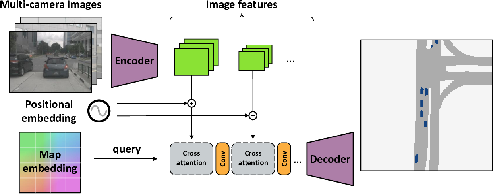
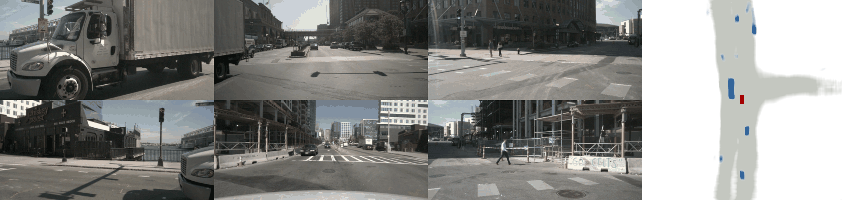
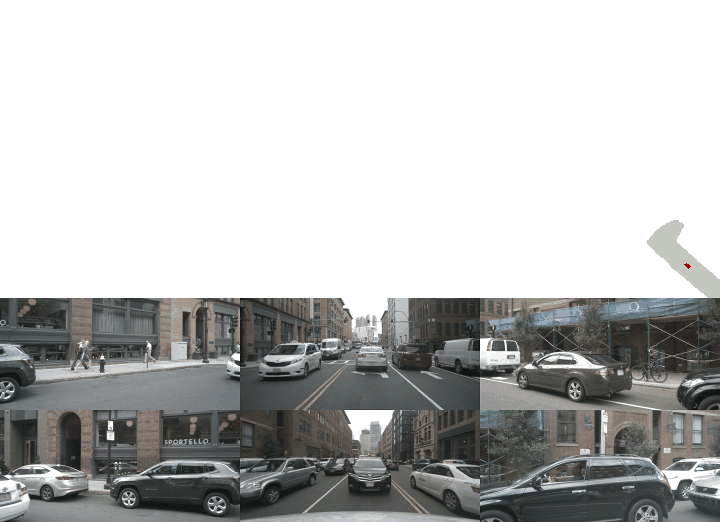

# <div align="center">**Cross View Transformers**</div>

<div align="center"></div>
<br>

This repository contains the source code and data for our paper:

> [**Cross-view Transformers for real-time Map-view Semantic Segmentation**](http://www.philkr.net/media/zhou2022crossview.pdf)  
> [Brady Zhou](https://www.bradyzhou.com/), [Philipp Kr&auml;henb&uuml;hl](http://www.philkr.net/)  
> [*CVPR 2022*](https://cvpr2022.thecvf.com/)

## <div align="center">**Demos**</div>

<br>

<div align="center"></div>
<div align="center">
<b>Map-view Segmentation:</b>
The model uses multi-view images to produce a map-view segmentation at 45 FPS
</div>
<br>

<div align="center"></div>
<div align="center">
<b>Map Making:</b>
With vehicle pose, we can construct a map by fusing model predictions over time
</div>
<br>

<div align="center"></div>
<div align="center">
<b>Cross-view Attention:</b>
For a given map-view location, we show which image patches are being attended to
</div>
<br>

## <div align="center">**Installation**</div>

```bash
# Clone repo
git clone https://github.com/bradyz/cross_view_transformers.git

cd cross_view_transformers

# Setup conda environment
conda create -y --name cvt python=3.8

conda activate cvt
conda install -y pytorch torchvision cudatoolkit=11.3 -c pytorch

# Install dependencies
pip install -r requirements.txt
pip install -e .
```

## <div align="center">**Data**</div>

<div align="center"></div>
<br>

Documentation:
* [Dataset setup](docs/dataset_setup.md)
* [Label generation](docs/label_generation.md) (optional)

<br/>

Download the original datasets and our generated map-view labels

| | Dataset | Labels |
| :-- | :-- | :-- |
| nuScenes | [keyframes + map expansion](https://www.nuscenes.org/nuscenes#download) (60 GB) | [cvt_labels_nuscenes.tar.gz](https://www.cs.utexas.edu/~bzhou/cvt/cvt_labels_nuscenes.tar.gz) (361 MB) |
| Argoverse 1.1 | [3D tracking](https://www.argoverse.org/av1.html#download-link) | coming soon™ |

<br/>

The structure of the extracted data should look like the following

```
/datasets/
├─ nuscenes/
│  ├─ v1.0-trainval/
│  ├─ v1.0-mini/
│  ├─ samples/
│  ├─ sweeps/
│  └─ maps/
│     ├─ basemap/
│     └─ expansion/
└─ cvt_labels_nuscenes/
   ├─ scene-0001/
   ├─ scene-0001.json
   ├─ ...
   ├─ scene-1000/
   └─ scene-1000.json
```

When everything is setup correctly, check out the dataset with

```bash
python3 scripts/view_data.py \
  data=nuscenes \
  data.dataset_dir=/media/datasets/nuscenes \
  data.labels_dir=/media/datasets/cvt_labels_nuscenes \
  data.version=v1.0-mini \
  visualization=nuscenes_viz \
  +split=val
```

# <div align="center">**Training**</div>

<div align="center">
<a href="https://www.pytorchlightning.ai">

</a>
&nbsp;&nbsp;&nbsp;&nbsp;&nbsp;&nbsp;
<a href="https://wandb.ai/site">

</a>
&nbsp;&nbsp;&nbsp;&nbsp;&nbsp;&nbsp;
<a href="https://hydra.cc">

</a>
</div>

<br>

An average job of 50k training iterations takes ~8 hours.  
Our models were trained using 4 GPU jobs, but also can be trained on single GPU.

To train a model,

```bash
python3 scripts/train.py \
  +experiment=cvt_nuscenes_vehicle
  data.dataset_dir=/media/datasets/nuscenes \
  data.labels_dir=/media/datasets/cvt_labels_nuscenes
```

For more information, see

* `config/config.yaml` - base config
* `config/model/cvt.yaml` - model architecture
* `config/experiment/cvt_nuscenes_vehicle.yaml` - additional overrides

## <div align="center">**Additional Information**</div>

### **Awesome Related Repos**

* https://github.com/wayveai/fiery
* https://github.com/nv-tlabs/lift-splat-shoot
* https://github.com/tom-roddick/mono-semantic-maps

### **License**

This project is released under the [MIT license](LICENSE)

### **Citation**

If you find this project useful for your research, please use the following BibTeX entry.

```bibtex
@inproceedings{zhou2022cross,
    title={Cross-view Transformers for real-time Map-view Semantic Segmentation},
    author={Zhou, Brady and Kr{\"a}henb{\"u}hl, Philipp},
    booktitle={CVPR},
    year={2022}
}
```
