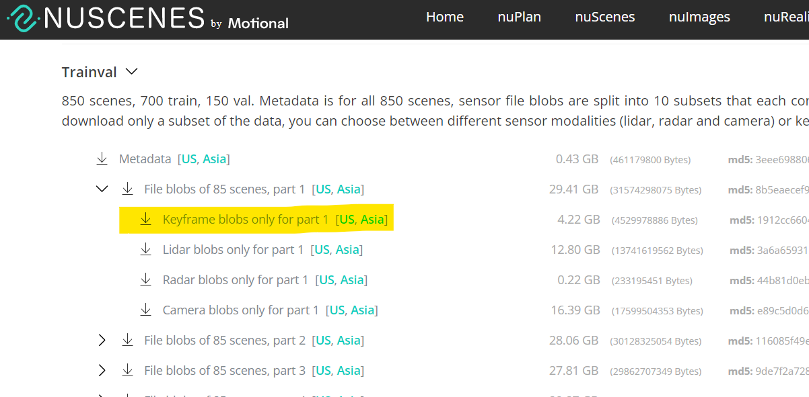

# **Dataset Setup**

For this walkthrough we'll use these aliases
* `/media/datasets/` home for all the extracted datasets
* `/path/to/downloads/` where your raw downloads are stored

The final directory structure looks like

```
/media/datasets/
├─ nuscenes/
│  ├─ v1.0-trainval/
│  ├─ v1.0-mini/
│  ├─ samples/
│  ├─ sweeps/
│  └─ maps/
│     ├─ basemap/
│     └─ expansion/
└─ cvt_labels_nuscenes/
   ├─ scene-0001/
   ├─ scene-0001.json
   ├─ ...
   ├─ scene-1000/
   └─ scene-1000.json
```

If you find any broken links, please create a Github issue or email 
<a href='ma&#105;&#108;to&#58;%62r&#37;6&#49;&#100;y%2E&#122;h%6F&#117;&#64;ute&#120;a&#115;&#46;&#101;du'>&#98;rad&#121;&#46;z&#104;o&#117;&#64;ute&#120;as&#46;edu</a>


## **Map-View Labels (1 GB)**

Download the labels we generated for our experiments

* [nuScenes](https://www.cs.utexas.edu/~bzhou/cvt/cvt_labels_nuscenes.tar.gz)

Extract the labels via

```bash
tar -xvf /path/to/downloads/cvt_labels_nuscenes.tar.gz -C /media/datasets
```

## **nuScenes Data (60 GB)**

Get the following files from [nuScenes](https://www.nuscenes.org/download).  
If you want to download from the command line via `curl` or `wget`, see this [Github issue](https://github.com/nutonomy/nuscenes-devkit/issues/110).

```bash
# Required: raw image frames
v1.0-trainval01_keyframes.tgz
v1.0-trainval02_keyframes.tgz
...
v1.0-trainval10_keyframes.tgz

# Required: metadata
v1.0-mini.tgz
v1.0-trainval_meta.tgz

# Optional: for generating map labels
nuScenes-map-expansion-v1.3.zip
```

This project only requires annotated keyframes, so remember to get those and save yourself some time/disk.

<p align="left"></p>

After the downloads (~50 gb in total) are finished, the last step is to untar/unzip the raw files.

```bash
mkdir /media/datasets/nuscenes/

# Untar all the keyframes and metadata
for f in $(ls /path/to/downloads/v1.0-*.tgz); do tar -xzf $f -C /media/datasets/nuscenes; done

# Map expansion must go into the maps folder
unzip /path/to/downloads/nuScenes-map-expansion-v1.3.zip -d /media/datasets/nuscenes/maps
```