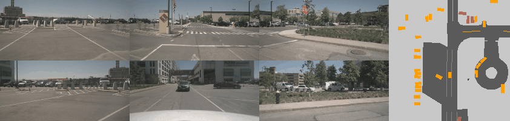

# **Label Generation**

<br>
<div align="center"></div>
<br>

Generating labels will require some extra dependencies

```bash
pip install nuscenes-devkit==1.1.7
```

## **Generating Labels**

This process takes around ~30 minutes for 1000 episodes on nuScenes.

To generate or modify labels,

```bash
# Show labels as they are being processed with the visualization argument
python3 scripts/generate_labels.py
    data=nuscenes \
    data.version=v1.0-trainval \
    data.dataset_dir=/media/datasets/nuscenes \
    data.labels_dir=/media/datasets/cvt_labels_nuscenes \
    visualization=nuscenes_viz

# Disable visualizations by omitting the "visualization" flag
python3 scripts/generate_labels.py \
    data=nuscenes \
    data.version=v1.0-trainval \
    data.dataset_dir=/media/datasets/nuscenes \
    data.labels_dir=/media/datasets/cvt_labels_nuscenes \
```

You can also set `data.version=v1.0-mini` to generate or test your modifications on a smaller subset.
